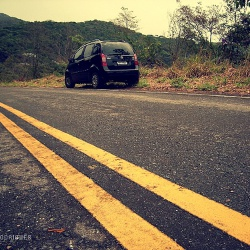
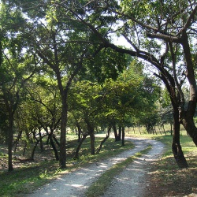

# Road image datasets

1) Images scrapped from [ImageNet](http://www.image-net.org/synset?wnid=n02900459#) image catalog (resized to 250x250). 494 road images. Also, it contains the scrapper script. Examples of images:
 
 
 

2) 
