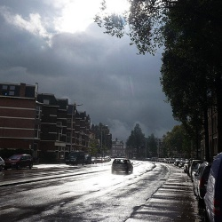
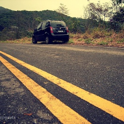
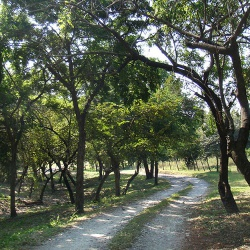
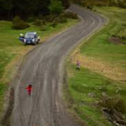
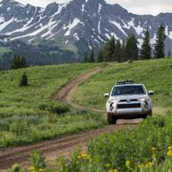
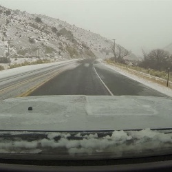

# My road image datasets

1) Images scrapped from [ImageNet](http://www.image-net.org/synset?wnid=n02900459#) image catalog (resized to 250x250). 494 road images. Also, it contains the scrapper script. Examples of images:
   

2) Road images scrapped from Google, Bing, Yahoo, Flickr (the scapper program is "Extreme picture finder"). 5,390 road images. Also, contains script for validating images by min requred size.
Road images are classified into 6 classes:
- dirt roads  
- forest roads  
- gravel roads  
- highway roads  
- rainy roads  
- snowy roads  
   

